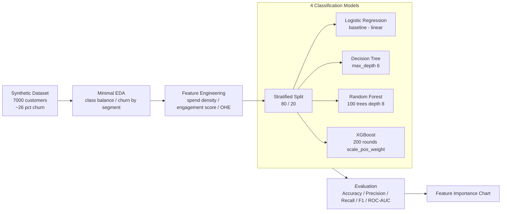

# Customer Churn Prediction

  

**Classification project** — Predict whether a telecom customer will churn in the next billing cycle. Mirrors patterns from real-world datasets (IBM Telco, Kaggle Telecom Churn). Enables proactive retention campaigns.

---

## Problem

Telecom companies lose 15–30% of customers annually. Acquiring a new customer costs 5× more than retaining one. An early-warning churn classifier lets the retention team target the right customers with the right offer — before they cancel.

---

## Architecture



---

## Dataset Features

| Feature | Type | Description |
|---------|------|-------------|
| tenure_months | numeric | 1–72 months with company |
| monthly_charges | numeric | $18–$118/month |
| total_charges | numeric | Cumulative billing |
| contract_type | categorical | Month-to-Month / One Year / Two Year |
| internet_service | categorical | DSL / Fiber Optic / None |
| payment_method | categorical | Credit Card / Bank Transfer / Electronic Check / Mailed Check |
| support_calls_6m | numeric | Complaints in last 6 months |
| has_streaming | binary | Streaming add-on (0/1) |
| has_tech_support | binary | Tech support plan (0/1) |
| num_products | numeric | Number of subscribed products |
| **churned** | **target** | **0 = retained, 1 = churned** |

**Feature Engineering steps:**
1. `avg_monthly_spend` = total_charges / tenure_months (value density signal)
2. `high_value` = monthly_charges > 75th percentile (binary flag)
3. `engagement_score` = has_streaming + has_tech_support + num_products
4. Ordinal encode `contract_type` (M2M=0 → Two Year=2)
5. One-hot encode `internet_service`, `payment_method`

---

## Model Results (sample)

| Model | Accuracy | Precision | Recall | F1 | ROC-AUC |
|-------|----------|-----------|--------|-----|---------|
| Logistic Regression | ~0.80 | ~0.65 | ~0.62 | ~0.63 | ~0.86 |
| Decision Tree | ~0.81 | ~0.66 | ~0.64 | ~0.65 | ~0.83 |
| Random Forest | ~0.84 | ~0.72 | ~0.67 | ~0.69 | ~0.91 |
| **XGBoost** | **~0.85** | **~0.74** | **~0.70** | **~0.72** | **~0.92** |

---

## Quickstart

```bash
git clone https://github.com/DataScienceAIpath/customer-churn-prediction
cd customer-churn-prediction
pip install -e ".[dev]"

# Full pipeline in one command
make run

# Or step by step
make generate   # creates data/churn_data.csv
make eda        # class balance + churn by segment + docs/eda_churn.png
make train      # stratified split + 4 models + comparison table

# Tests
make test
```

---

## Tech Stack

- **scikit-learn** — LogisticRegression, DecisionTree, RandomForest + StratifiedShuffleSplit
- **XGBoost** — `scale_pos_weight` for class imbalance
- **pandas + numpy** — data generation & feature engineering
- **matplotlib + seaborn** — EDA and feature importance charts
- **Typer + Rich** — coloured CLI and comparison table
- **pytest** — unit tests for generator, features, and model ROC-AUC quality
- **ruff + black** — lint & format

---

## How It Works

```
src/
├── data/generator.py       # Synthetic 7K dataset with logistic-model churn labels
├── eda/analysis.py         # Class balance, tenure histogram, churn rate by segment
├── features/engineering.py # Spend density + engagement + ordinal/OHE encoding
├── models/trainer.py       # Train LogReg / DT / RF / XGBoost (scale_pos_weight)
├── models/evaluator.py     # Acc / Precision / Recall / F1 / ROC-AUC table + feature importance
└── cli.py                  # generate / eda / train / run-all commands
```

**Why ROC-AUC over Accuracy?** With ~26% churn (imbalanced), a naive "always predict 0" model gets 74% accuracy. ROC-AUC measures how well the model ranks churners above non-churners regardless of threshold.

---

## Author

**Maniswaroop M** — AI/ML Engineer & Online Trainer
[GitHub](https://github.com/DataScienceAIpath)
